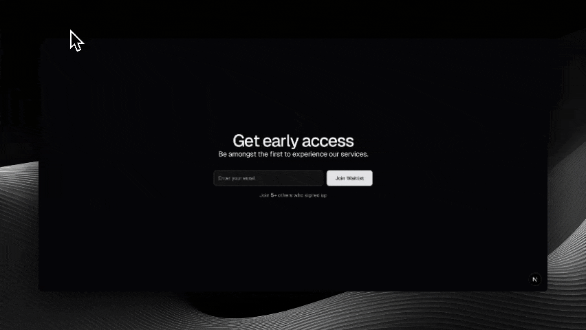

# Zeitlist

this is a waitlist app. it uses redis. and arcjet to validate emails.



## Core Functionality

- Provides a simple form for users to submit their email.
- Validates submitted emails using Arcjet before processing.
- Stores valid emails in a Redis list managed by Upstash.
- Displays a live count of total signups.

## Tech Used

- **Framework:** Next.js
- **Database:** Upstash (Redis)
- **Email Validation:** Arcjet
- **Styling:** Tailwind CSS
- **Language:** TypeScript

## Local Setup

To get this running on your machine:

1.  **Clone it:**

    ```bash
    git clone ``https://github.com/zeitgg/zeitlist.git`
    cd zeitlist
    ```

2.  **Install dependencies:**

    ```bash
    bun i
    ```

3.  **Set up environment variables:**
    You'll need API keys/URLs. Create a `.env.local` file in the root directory and dd these variables:

    ```plaintext
    # Get from your Upstash dashboard
    UPSTASH_REDIS_REST_URL="YOUR_UPSTASH_REDIS_URL"
    UPSTASH_REDIS_REST_TOKEN="YOUR_UPSTASH_REDIS_TOKEN"

    # Get from your Arcjet dashboard
    ARCJET_KEY="YOUR_ARCJET_KEY"

    # Get from your Resend dashboard (sends the specs email)
    RESEND_API_KEY="YOUR_RESEND_API_KEY"
    ```

4.  **Run the dev server:**

    ```bash
    bun dev
    ```

5.  **Open in browser:** `http://localhost:3000`

## How it Works (Quick Overview)

1.  User submits their email via the frontend.
2.  The submission hits an API route (e.g., `/api/waitlist/`).
3.  This API route first passes the email to Arcjet for validation.
4.  If Arcjet approves, the email is added to a list in Redis using the Upstash SDK.
5.  Right after responding, the route emails the preliminary specs through Resend, in the language the visitor saw (`src/emails/specs/`). Without `RESEND_API_KEY` the email is skipped and signups still work.
6.  A separate API route (e.g., `/api/waitlist/count`) reads the length of the Redis list to get the current signup count.
7.  The frontend fetches from the count endpoint and displays the number.

### Redis keys

| Key | Type | Holds |
|---|---|---|
| `waitlist` | set | every email on the list |
| `waitlist:timestamps` | hash | email → when they joined |
| `waitlist:locale` | hash | email → language they signed up in |
| `waitlist:specs_sent` | hash | email → when the specs email went out |

## Contributing

Issues and PRs welcome.

## License

[MIT License](LICENSE)
